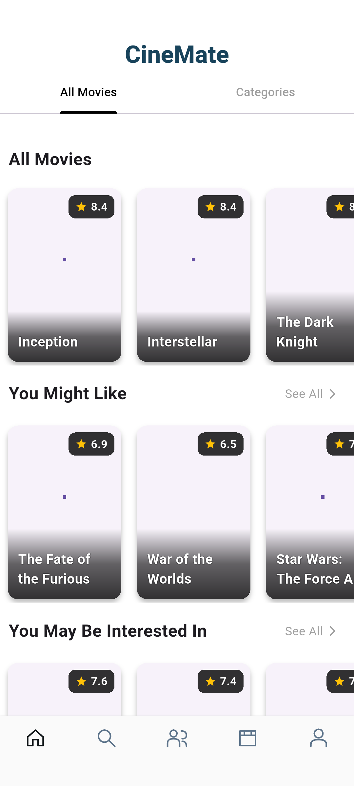
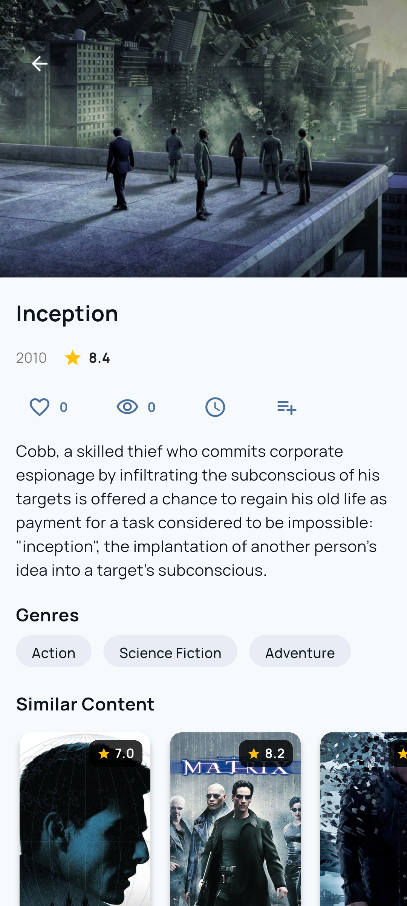
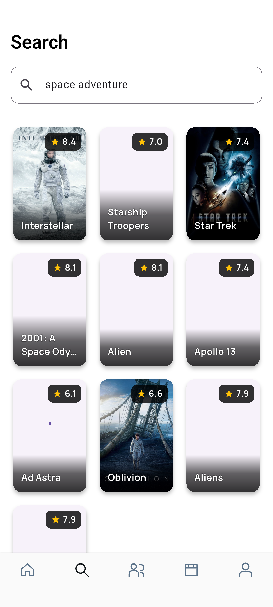

# CineMate

A Flutter application for discovering films, building collections and finding recommendations from your viewing preferences. The FastAPI backend combines MongoDB Vector Search with 1024-dimensional Ollama embeddings.

**Portfolio scope:** Android application + reproducible backend + real demo data. This is a noncommercial project. Other platform folders are experimental, not a claim of tested support.

| Discovery | Film details | Semantic search |
| --- | --- | --- |
|  |  |  |

More views: [similar users](docs/screenshots/04-similar-users.png), [collections](docs/screenshots/05-collections.png), [collection detail](docs/screenshots/06-collection-detail.png), [profile](docs/screenshots/07-profile.png).

## Features

- Registration, login, persistent sessions and rotating refresh tokens.
- Movie discovery, semantic search and similar movies.
- Likes, watched history, watchlist, personal recommendations and similar users.
- Public/private collections and comments with author-only editing/deletion.
- Loading, empty and error handling with safe avatar/poster fallbacks.

[Architecture](docs/architecture.md) · [Backend](https://github.com/CineMatePlus/cinemate_backend) · [Asset provenance](ASSETS_LICENSES.md)

## Reproducible Android setup

Pinned: Flutter **3.47.1**, Dart **3.13.1**, JDK **21**, Gradle **8.14.3**, AGP **8.11.1**, Kotlin **2.2.20**, NDK **28.2.13676358**. Flutter emits future-support warnings for this supported Gradle/AGP generation; dependency validation is not bypassed.

```sh
flutter config --jdk-dir=/absolute/path/to/jdk-21
flutter pub get --enforce-lockfile
python3 scripts/generate.py
flutter run --dart-define=API_BASE_URL=http://10.0.2.2:8000
```

Start the backend using its README first. `10.0.2.2` connects the Android emulator to the host. For a USB-connected physical device use `adb reverse tcp:8000 tcp:8000` and `API_BASE_URL=http://127.0.0.1:8000`. A LAN device needs the computer's LAN address and a reachable server.

## Checks

```sh
dart format --output=none --set-exit-if-changed lib test integration_test test_driver
flutter analyze --fatal-infos
flutter test --coverage
flutter build apk --debug
```

`integration_test/auth_test.dart` exercises registration/session restoration/logout against a real API. Use an isolated database. CI starts a backend checkout pinned by `.backend-ref` and an Android emulator.

## Release signing

Copy `android/key.properties.example` to the ignored `android/key.properties` and fill in your external keystore path and credentials. No private signing key is committed and release builds do not use debug keys.

```sh
flutter build apk --release --dart-define=API_BASE_URL=https://your-demo-host.example
```

An explicitly local demo release can opt into HTTP:

```sh
ORG_GRADLE_PROJECT_allowLocalDemo=true flutter build apk --release \
  --dart-define=API_BASE_URL=http://127.0.0.1:8013 \
  --dart-define=ALLOW_LOCAL_DEMO=true
adb reverse tcp:8013 tcp:8013
```

The local-demo APK requires the backend; it is not a standalone offline application. Do not use local-demo settings for an internet-facing service.

## Recreate screenshots

Use the backend `scripts/seed_demo.py` with the isolated `cinemate_demo` database. Supply `DEMO_PASSWORD` locally, never in Git. Create an external JSON file containing `API_BASE_URL` and `DEMO_PASSWORD`, then run:

```sh
flutter drive --driver=test_driver/integration_test.dart \
  --target=integration_test/demo_test.dart -d emulator-5554 \
  --dart-define-from-file=/absolute/path/outside/repo/demo-defines.json
```

The test navigates real screens and writes PNGs to `docs/screenshots/`. These use synthetic accounts and include TMDB imagery.

## Limits and credits

Profile editing, password-reset email, biometrics, push notifications and offline synchronization are outside this release. Semantic search needs the embedding service; the dataset primarily contains English descriptions. No large-scale or recommendation-accuracy benchmark is claimed.

This product uses the TMDB API/data but is not endorsed or certified by TMDB. Data attribution and conditions: [backend DATA_NOTICE](https://github.com/CineMatePlus/cinemate_backend/blob/main/DATA_NOTICE.md). Source code is [MIT licensed](LICENSE).
