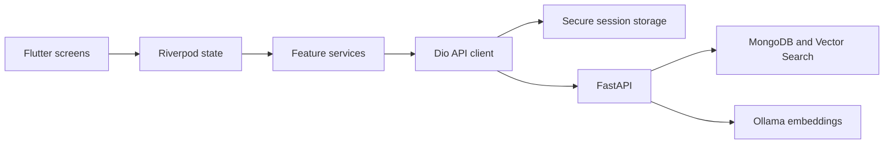

# CineMate mobile architecture

CineMate is a Flutter Android portfolio application backed by the CineMate FastAPI API. iOS, desktop and web have not passed this release's acceptance process.

## Implemented structure

- `lib/modules`: discovery, search, movie detail, collections, comments, profile statistics and similar users.
- Riverpod 2 providers and StateNotifiers hold screen state. Services call a shared Dio API client; there is no separate repository abstraction.
- Freezed models are generated by the pinned build_runner toolchain. Committed generated files are checked in CI.
- `SessionStore` stores an access/refresh pair in one secure-storage value. Legacy access-only sessions require login again.
- A single pending refresh operation is shared by concurrent requests. Explicit 401 responses can be retried once after refresh; timeouts and uncertain writes are not retried automatically.
- Network failure preserves the refresh session. Confirmed rejection clears credentials and navigates to login. Server logout revokes the refresh family; existing access tokens retain the backend's documented maximum lifetime.
- Feature services depend on the authenticated user ID so account changes invalidate user-specific screen data.

## API and error handling

`API_BASE_URL` selects the server; `/api/v1` is appended once. Services use `/auth`, `/movies`, `/users/me`, `/collections`, `/comments` and `/interactions` routes. Private collections use the `is_public` wire field. Public profiles do not contain email.

The client sets connection, send and receive deadlines. Backend validation/conflict errors surface in the UI. Recommendation lists are bounded sets; the application does not claim offset pagination for that endpoint. Search discards stale responses.

## Deliberate limits

There is no password-reset email flow, profile editor, biometric login, certificate pinning, push notification, payment integration or full offline synchronization. The app uses the platform's HTTPS certificate validation. Local demo HTTP requires explicit configuration in a release build. These limits must remain visible in portfolio claims.

## Build and checks

See the root README for the pinned Flutter/JDK/Gradle versions, code generation, unit/widget tests, Android integration tests and signing setup. Screenshot automation is a real backend integration test, not a mock UI renderer.
